# NextFinUp 메뉴 구조도

메뉴 구조는 "무엇이 무엇 아래에 있는가"를 보여주는 **계층 트리(sitemap)**가 맞습니다. 플로우차트는 보통 "다음에 뭘 할지" 갈라지는 프로세스/의사결정을 그릴 때 쓰는데, 메뉴는 순서가 아니라 소속 관계라서요. 다만 그리는 도구(Mermaid)는 플로우차트용 문법을 그대로 씁니다 — 결과물만 트리 형태로 나옵니다.

실제 상단 메뉴(Menu 테이블, 랜딩/헤더 공통) 5개를 기준으로, 각 메뉴 아래 실제 존재하는 하위 화면만 추렸습니다(전체 URL 목록이 아니라 "대략"한 구조).

```mermaid
flowchart TD
    ROOT["NextFinUp"]

    ROOT --> NAV1["경제 동향<br/>(뉴스 게시판)"]
    NAV1 --> NAV1a["뉴스 상세<br/>· AI 요약 · 재발행"]
    NAV1 --> NAV1b["URL 스크랩 (회원)"]
    NAV1 --> NAV1c["글 직접 작성 → 포스팅"]

    ROOT --> NAV2["대시보드"]
    NAV2 --> NAV2a["지수 차트<br/>(코스피/코스닥)"]
    NAV2 --> NAV2b["종목 검색 → 종목 상세<br/>(일봉/분봉)"]
    NAV2 --> NAV2c["등락률 상위 · 진짜 특징종목"]
    NAV2 --> NAV2d["매수/매도 신호 종목"]

    ROOT --> NAV3["자산관리<br/>(nginx 정적 서빙, Django 무관)"]
    NAV3 --> NAV3a["채권 · 부동산 · 보험"]
    NAV3 --> NAV3b["IRP · ISA · 국민연금 · 저축성연금"]
    NAV3 --> NAV3c["청년저축 · 전문상담원 소개"]

    ROOT --> NAV4["전문가 소개"]
    NAV4 --> NAV4a["상담 신청"]

    ROOT --> NAV5["구독"]
    NAV5 --> NAV5a["구독 신청"]

    ROOT --> AUTH["로그인 / 회원가입"]
    AUTH --> AUTH1["이메일 로그인"]
    AUTH --> AUTH2["카카오 · 구글 · 네이버<br/>소셜 로그인"]

    ROOT --> MY["마이페이지<br/>(로그인 후)"]
    MY --> MY1["관심 키워드 설정"]
    MY --> MY2["자동 포스팅<br/>(WordPress/Blogger 연동)"]
    MY2 --> MY2a["연결 가이드 · 애드센스 가이드"]
    MY --> MY3["내 포스팅 이력"]

    ROOT --> ADMIN["관리자"]
    ADMIN --> ADMIN1["/admin<br/>(시스템 관리, 슈퍼유저 전용)"]
    ADMIN --> ADMIN2["/staff<br/>(업무 관리: 상담·구독)"]
    ADMIN --> ADMIN3["/admin-tools<br/>(크론·파이프라인 상태)"]

    ROOT --> ETC["기타"]
    ETC --> ETC1["뉴스레터 구독/해지"]
    ETC --> ETC2["보험 비교"]
    ETC --> ETC3["개인정보처리방침 · 이용약관"]
```

**확인 결과**: "자산관리" 메뉴(`/asset-management/`)는 Django 라우트가 아니라 nginx가 `/home/ubuntu/nextfinup/asset-management/` 디렉토리를 그대로 서빙하는 정적 HTML 사이트입니다(`location /asset-management/ { alias .../asset-management/; }`, `/etc/nginx/sites-available/nextfinup`). Django ORM·DB와 무관하게 독립적으로 관리됩니다.
